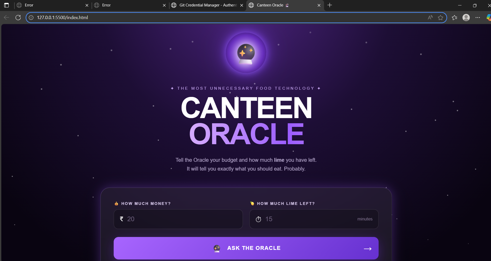
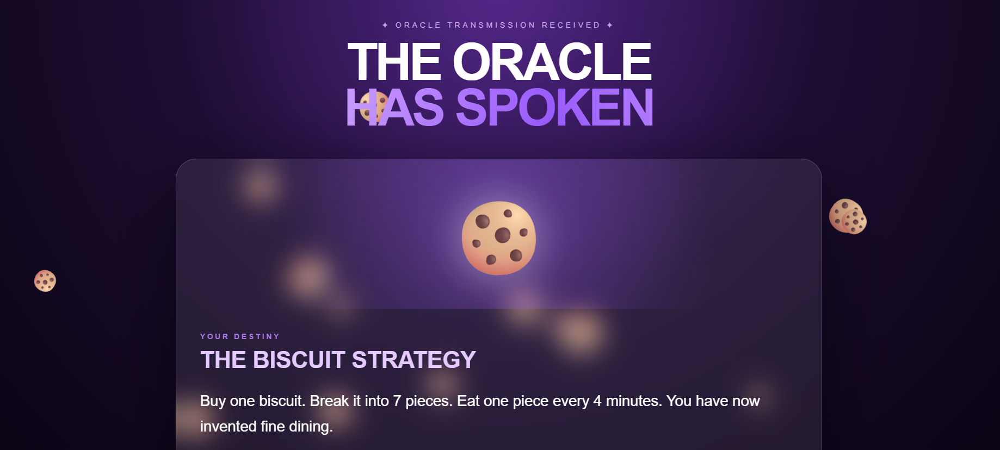
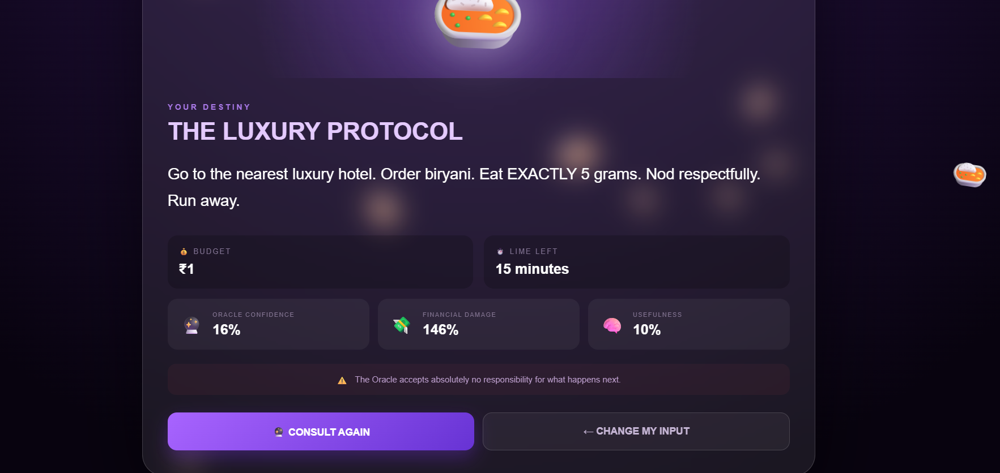

# [Project canteen oracle] 🎯

## Basic Details
### Team Name: [ the pridictors]

### Team Members
- Member 1: [Chaithra P] - [scms school of engineering and technology,karukutty]
- Member 2: [Devanjali Rageesh] - [scms school of engineering and technology,karukutty]

### Project Description
[canteen oracle is useless project but hilarious ai style website that predict what you should eat on your budget and time.it gives a dramatic,completely random food recommemdations with fake AI confidence and ridiculous reaspning.Build for fun,it turns asimple canteen decision into an unnecessarily serious"oracle consultation". ]

### The Problem (that doesn't exist)
[we are solving the serious problem of not knowing what to eat in the cateen when you have limitted budget,limited time,and absulutely no clue what you want.]

### The Solution (that nobody asked for)
[enter your budget,time,and the oracle do completely unnecessary"AI"magic boom,your food dentiny is revealed]

## Technical Details
### Technologies/Components Used
For Software:
- [HTML,CSS,java script]
- [none]
- [none]
- [VS Code,Github,Github pages]

### Implementation
For Software:A fun app webapp where users enter their budget and time and javascript process the input to generate a random,dramatic canteen food prediction.
# Installation
[clone the repo or download index.html,settings.json,result.html,style.css]

# Run
[open index.html next Right click next open with live server]

### Project Documentation
For Software:canteen oracle is a fun web-based application built using HTML,CSS and javascript.users enters their budget,avilable time and the system generates a humorous food prediction using simple JavaScript logic.

# Screenshots (Add at least 3)

*Add caption explaining what this show

*Add caption explaining what this shows*

*Add caption explaining what this shows*

# Diagrams
START
          ↓
   Open Canteen Oracle
          ↓
 Enter Budget + Time + Mood
          ↓
   JavaScript processes
       the inputs
          ↓
   🔮 Oracle predicts
       your food
          ↓
   Funny Food Result
          ↓
         END
*Add caption explaining your workflow*

# Schematic & Circuit
Not applicable – Canteen Oracle is a software-only web application and does not use electronic circuits or hardware components
*Add caption explaining connections*
┌──────────────┐
│     START    │
└──────┬───────┘
       ↓
┌─────────────────────┐
│ Enter Budget, Time  │
│      & Mood         │
└──────────┬──────────┘
           ↓
┌─────────────────────┐
│ JavaScript Processes│
│      Inputs         │
└──────────┬──────────┘
           ↓
┌─────────────────────┐
│   🔮 Canteen Oracle │
│     Predicts Food   │
└──────────┬──────────┘
           ↓
┌─────────────────────┐
│   Funny Food Result │
└─────────────────────┘

### deploy link 

## Team Contributions
- [Name 1]: [Specific contributions]
- [Name 2]: [Specific contributions]
- [Name 3]: [Specific contributions]

---
Made with ❤️ at TinkerHub Useless Projects 

